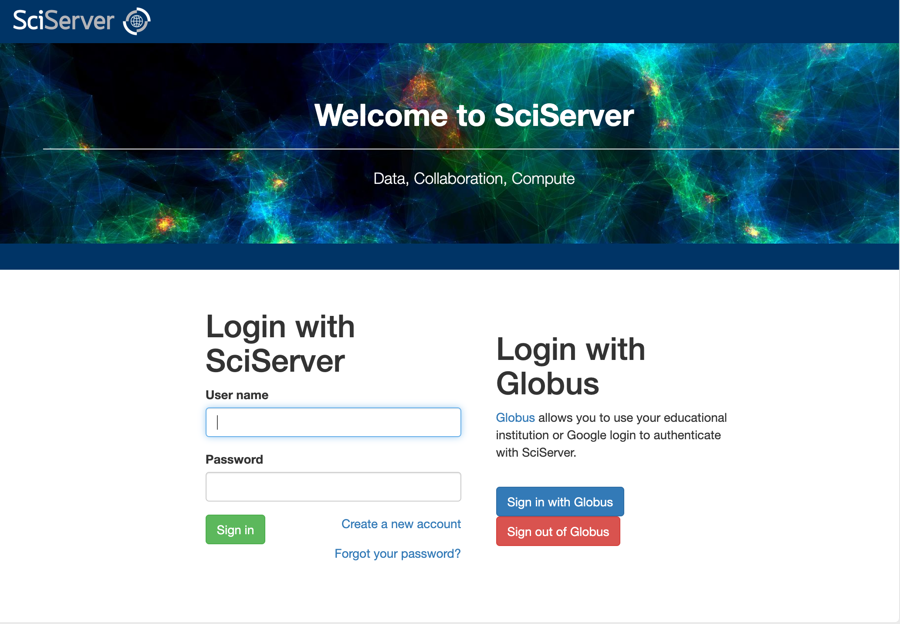
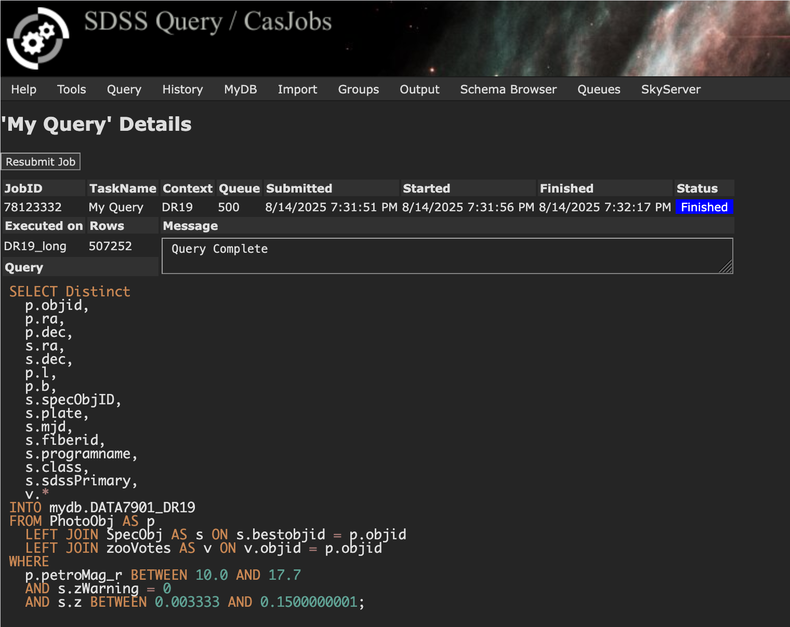

## DATA7901 Galaxy Classification Starter (UQ)

This repository is a ready-to-run starter kit for the semester project described in `galaxy_classification_guide.md`. It walks you through getting the data from SDSS, exploring key columns, and downloading/visualising galaxy images and spectra.

### What you’ll do
- Run the provided SQL on SDSS CasJobs to build your project table
- Export the table to CSV and place it in this repo
- Use the notebooks to validate data, plot histograms, and fetch/preview cutouts and spectra

### Repo layout
- `galaxy_classification_guide.md`: Project background and goals (read this first)
- `input/queries/DATA7901_DR19_casjobs.sql`: SQL to run on SDSS CasJobs
- `input/tables/`: Put your exported CSV here (expected filename: `DATA7901_DR19.csv`)
- `input/images/`: JPEG cutouts downloaded by the notebook
- `input/spectra/`: FITS spectra downloaded by the notebook
- `notebooks/explore_tables.ipynb`: Main walkthrough: load CSV, validate fields, histograms, download and visualise images and spectra
- `notebooks/get_cutouts.ipynb`: Additional cutout helper notebook (optional)
- `src/`: We will keep all the Python scripts associated with the project here. If we talk about a Python script (any `*.py` file), it is stored in `src/`.
- `models/`: This folder keeps all the trained models (saved checkpoints/weights, experiment outputs).

### Prerequisites
- Python 3.10+ (tested with 3.12)
- Jupyter (Lab or Notebook)
- Packages: `numpy`, `pandas`, `matplotlib`, `astropy`
- Command-line `wget` (recommended) for downloads
  - macOS: `brew install wget`
  - Ubuntu/Debian: `sudo apt-get install wget`
  - Windows: use WSL or install wget; the notebook also includes a Python fallback for images

Suggested environment setup:
```bash
python -m venv .venv
source .venv/bin/activate   # Windows: .venv\Scripts\activate
pip install jupyter numpy pandas matplotlib astropy
```

Alternative using conda:
```bash
conda create -n data7901 python=3.12 -y
conda activate data7901
pip install jupyter numpy pandas matplotlib astropy
```

### Step 1 — Build the table in SDSS CasJobs
CasJobs portal for running SDSS SQL queries: [https://casjobs.sdss.org/casjobs/](https://casjobs.sdss.org/casjobs/)
1) Go to the SDSS CasJobs website and sign in (create an account if needed).
   You should see a page similar to this:

   

2) Click "Login". You can create a new SciServer account or use Globus to authenticate:

   

3) After confirming your email and completing sign-in, you should see the CasJobs query workspace. This is where you'll paste and run the SQL provided in this repo:

   

4) Open a new query window and paste the contents of `input/queries/DATA7901_DR19_casjobs.sql`.
   - The query creates `mydb.DATA7901_DR19` with the following (key) columns:
     - `objid`, `ra`, `dec`, Galactic `l`, `b`
     - Spectra identifiers: `specObjID`, `plate`, `mjd`, `fiberid`, `class`, `programname`, `sdssPrimary`
     - Galaxy Zoo votes (counts; nvote_*):
       - `nvote_tot`: total votes
       - `nvote_std`: votes for the standard classification
       - `nvote_mr1`: votes for the vertical mirrored classification
       - `nvote_mr2`: votes for the diagonally mirrored classification
       - `nvote_mon`: votes for the monochrome classification
     - Galaxy Zoo vote fractions (p_*; values in [0,1]):
       - `p_el`: elliptical
       - `p_cw`: clockwise spiral
       - `p_acw`: anticlockwise spiral
       - `p_edge`: edge-on disk
       - `p_dk`: don't know
       - `p_mg`: merger
       - `p_cs`: combined spiral (cw + acw + edge-on)

   SDSS schema references (useful while building and inspecting your table):
   - SDSS Table Descriptions: [https://skyserver.sdss.org/dr7/en/help/docs/tabledesc.asp](https://skyserver.sdss.org/dr7/en/help/docs/tabledesc.asp)
   - TABLE PhotoObj: [https://skyserver.sdss.org/dr7/en/help/browser/browser.asp?n=PhotoObj&t=U](https://skyserver.sdss.org/dr7/en/help/browser/browser.asp?n=PhotoObj&t=U)
   - TABLE SpecObj: [https://skyserver.sdss.org/dr7/en/help/browser/browser.asp?n=SpecObj&t=U](https://skyserver.sdss.org/dr7/en/help/browser/browser.asp?n=SpecObj&t=U)
   - TABLE zooVotes (Galaxy Zoo): [https://skyserver.sdss.org/dr8/en/help/browser/description.asp?n=zooVotes&t=U](https://skyserver.sdss.org/dr8/en/help/browser/description.asp?n=zooVotes&t=U)
   - The filters in the SQL (magnitude and redshift cuts, and `zWarning = 0`) keep the result manageable.

5) Submit the query. Within a few seconds to minutes (depending on load), the job status should be "Finished" with the message "Query Complete". That confirms your table was created in `MyDB` without errors:

   

6) When it completes, export the results from `mydb.DATA7901_DR19` as CSV.
7) Save the CSV locally as `DATA7901_DR19.csv` and place it at:
```
input/tables/DATA7901_DR19.csv
```

Notes:
- Some tools may rename duplicate column names (e.g., `ra`, `dec` appear in multiple joined tables). The provided notebooks expect the CSV format produced by CasJobs; the examples here already work with the CSV used during development.

### Step 2 — Explore and validate the table
Open `notebooks/explore_tables.ipynb` and run the cells in order:
- Load the CSV from `input/tables/DATA7901_DR19.csv`.
- Validate completeness and ranges for all Galaxy Zoo fields for rows where `class == 'GALAXY'`:
  - p_* (fractions in [0,1]): `p_el`, `p_cw`, `p_acw`, `p_edge`, `p_dk`, `p_mg`, `p_cs`
  - nvote_* (non-negative integers): `nvote_tot`, `nvote_std`, `nvote_mr1`, `nvote_mr2`, `nvote_mon`
- Plot histograms for all `p_*` and all `nvote_*` columns.

### Step 3 — Download a few image cutouts (optional throttle)
In the same notebook:
- A cell prepares “valid galaxies” and builds the Legacy Survey cutout URLs.
- By default, it prints commands and limits downloads (e.g., first 10). You can increase or decrease `num_to_download`.
- Images are saved as `input/images/<objid>.jpeg`.

If you don’t have `wget`, either install it or use the Python fallback cell (already included) that uses `urllib` to fetch the same URLs.

### Step 4 — Visualise the cutouts
- The notebook includes a cell that shows the first 10 downloaded JPEGs side-by-side with titles from the filename (`objid`).

### Step 5 — Download and visualise spectra (optional)
- The notebook includes a cell to download the first N spectra using `plate`, `mjd`, and `fiberid` into `input/spectra/`.
- It then plots a few spectra using `astropy.io.fits` to read common SDSS formats (prefers table HDUs with `loglam`/`flux`, falls back to image HDUs with `COEFF0/COEFF1`).


### Troubleshooting
- “File not found”: confirm your CSV is named `DATA7901_DR19.csv` and placed under `input/tables/`.
- Missing `wget`: install it or use the Python fallback image downloader cell.
- Missing `astropy`: `pip install astropy`.
- Spectra 404s: not every `plate/mjd/fiberid` exists at the hard-coded path. Try a few, or adjust the base URL.
- Duplicate columns in CSV: CasJobs (and pandas) may rename duplicates; the provided notebook uses columns as exported during development.

### Next steps (project work)
After you’ve verified the data flows end-to-end:
- Feature engineering from tables (e.g., thresholds on `p_el`, vote counts)
- Image models (CNNs) and spectral models
- Model evaluation and reporting


Tips:
- Be gentle with external services. Keep download limits small (e.g., 10–50) while testing.
- Think carefully about data volume before mass downloads (cutouts/spectra can be many large files):
  - Start small; download a handful first and verify your pipeline end‑to‑end.
  - Estimate storage needs (files × average size) and ensure you have space and bandwidth.
  - Save to the intended locations (`input/images/`, `input/spectra/`) and keep a tidy directory structure.
  - If pushing to github remember to add large files and folders to the gitignore file
  - Consider caching, checkpoints, or manifests to avoid repeated downloads.
  - If you need everything, parallelize cautiously and be respectful of rate limits.

#### Understanding Your Astronomical Data

- **Exploratory Data Analysis (EDA) is crucial**:
  - Visualize distributions of key features (redshift, magnitude, colors)
  - Check class imbalance in galaxy types
  - Identify correlations between features
  - Understand missingness patterns (not random in astronomy!)
  
- **Domain-specific considerations**:
  - Photometric errors are not uniform (fainter objects = larger errors)
  - Selection effects: your sample may be biased by survey limitations
  - Physical relationships exist (e.g., color-magnitude diagrams)

#### Astronomy-specific ML Considerations

- **Feature engineering opportunities**:
  - Color indices (e.g., g-r, r-i)
  - Morphological parameters from images
  - Spectral line ratios and equivalent widths
  - Photometric redshift estimates
  
- **Handling measurement uncertainties**:
  - Consider using error-weighted loss functions
  - Propagate uncertainties through your pipeline
  - Bootstrap/Monte Carlo for uncertainty quantification

#### Scalability and Efficiency

- **Memory management**:
  - Use data generators/loaders for large datasets
  - Consider chunking strategies for processing
  - Profile memory usage before scaling up
  
- **Model complexity vs. performance trade-off**:
  - Start with simple, fast models for baseline
  - Document training time and inference speed
  - Consider model size for deployment scenarios

#### Project Organization and Reproducibility

- **Version control best practices**:
  - Don't commit large data files (use .gitignore)
  - Document random seeds for reproducibility
  - Keep a changelog of experiments
  
- **Documentation requirements**:
  - README with clear setup instructions
  - Requirements.txt or environment.yml
  - Jupyter notebooks with markdown explanations
  - Final report linking to industry applications

#### Guidance for building ML models

- First and foremost, this is your project — organize it in a way that works for you and be innovative.
- Break work into small tasks:
  - Clarify the objective (what is success?).
  - Choose problem type: Classification vs Regression.
  - Prepare your data: handle missing values, outliers, scaling, encode categoricals.
  - Choose and implement cross‑validation.
  - Select candidate models; train baselines and iterate.
  - Evaluate with appropriate metrics; fine‑tune hyperparameters.

- Cross-validation options (pick what fits your data):
  - **Stratified K-fold**: Recommended for imbalanced galaxy classes
  - **Hold-out**: Good for large datasets (70/15/15 or 60/20/20 split)
  - **Time-based split**: If using time-series spectral features
  - K-fold: Standard choice for balanced datasets
  - Group K-fold: If galaxies are grouped (e.g., by survey region)

- Data and model types:
  - Supervised: has one or more targets
    - Classification: predict a category
    - Regression: predict a continuous value
  - Unsupervised: no target (e.g., clustering, dimensionality reduction)

- Tabulated data — common model choices:
  - Decision Trees
  - Random Forests
  - Logistic Regression
  - Gradient Boosting (e.g., XGBoost/LightGBM/CatBoost)
  - Symbolic Regression (PySR/gplearn) — discovers interpretable equations
  - Neural Networks (use judiciously; simpler models may match performance with less complexity)

- Evaluation metrics (select per objective):
  - **Classification**: 
    - Confusion matrix (essential for multi-class)
    - Per-class precision/recall (identify weak classes)
    - Weighted/macro/micro F1 scores
    - ROC curves for each class (one-vs-rest)
  - **Regression** (if predicting continuous properties):
    - MAE, MSE, RMSE
    - R² score
    - Residual plots

- Deep Learning considerations:
  - CNNs for galaxy images (consider transfer learning from pre-trained models)
  - 1D CNNs or LSTMs for spectra
  - Attention mechanisms for identifying important features
  - Start with smaller architectures; deep ≠ better
  - Monitor for overfitting (use early stopping, dropout)

#### Common Pitfalls to Avoid

- Data leakage: Ensure no target information in features
- Overfitting to small samples: Use proper validation
- Ignoring class imbalance: Consider SMOTE, class weights
- Not checking data quality: Remove artifacts, bad pixels
- Forgetting to scale features: Especially mixing images/tabular data
- Training on incomplete data: Handle NaNs before modeling

### Acknowledgements
- SDSS CasJobs and data services
- Legacy Survey image cutouts


